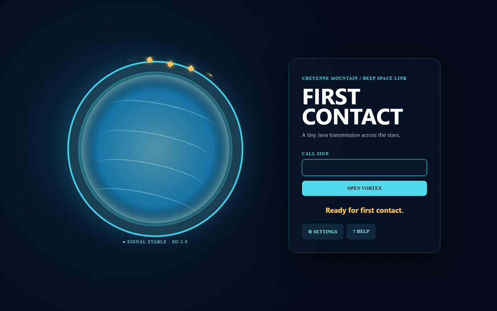
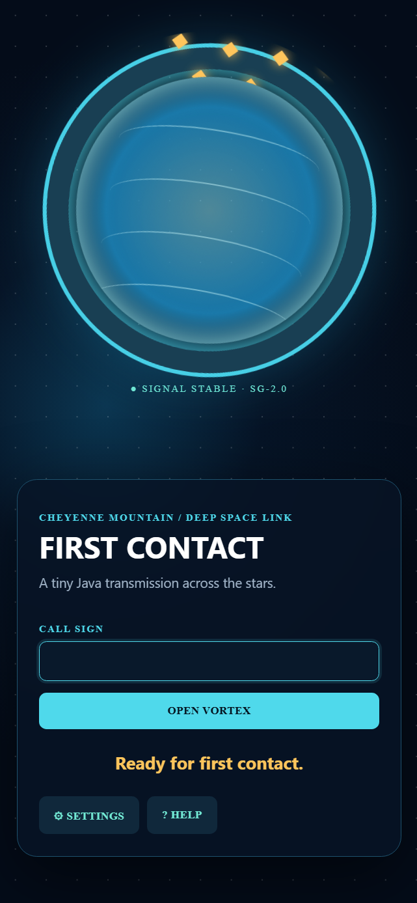

# GreetingsApp 2 · Event Horizon 🌀

   

A tiny Hello World has opened a much larger vortex. **GreetingsApp** is now a polished first-contact station for the desktop, terminal and phone, while remaining a readable Java learning project.



<p align="center"></p>

## Launch

### Phone and browser

Open **[GreetingsApp online](https://sofoste93.github.io/GreetingsApp/)**. Use the browser menu to install it; after the first visit it also starts offline.

### Windows, Linux and macOS

Download the archive for your system from **[Releases](https://github.com/sofoste93/GreetingsApp/releases/latest)**, extract it and run `GreetingsApp`. The Java runtime is included, so no JRE setup is needed.

### Developers

```bash
git clone https://github.com/sofoste93/GreetingsApp.git
cd GreetingsApp
mvn test
mvn package
java -jar target/GreetingsApp.jar
```

Terminal transmission: `java -jar target/GreetingsApp.jar --greet "Thor"`.

## Mission systems

- animated Java2D event horizon and responsive mobile counterpart
- English, French and German with a saved language setting
- contextual greetings, keyboard support, built-in settings and help
- installable offline PWA for Android and iPhone/iPad
- native app images with an included Java runtime for four desktop targets
- automated tests, checksums and reproducible CI/release workflows
- focused teaching comments plus the **[step-by-step learning guide](docs/LEARNING_GUIDE.md)**

## Project map

```text
src/main/java/   Java application and greeting logic
src/test/java/   unit tests
web/             dependency-free installable PWA
scripts/         local jpackage helpers
.github/         CI, releases and GitHub Pages
docs/            learning material and screenshots
```

The PWA stores only the language preference on the device. It has no analytics, account or server.

## Build a desktop image

Windows: `powershell -File scripts/package.ps1`

Linux/macOS: `bash scripts/package.sh`

The result in `dist/` contains its own Java runtime. Windows may still show “Unknown publisher” until the release executable is signed with an Authenticode certificate; the workflow is ready for that certificate to be added later.

## Credits

Created by [@sofoste93](https://github.com/sofoste93). Version 1 began in December 2020; Event Horizon v2 was restored in October 2026.
